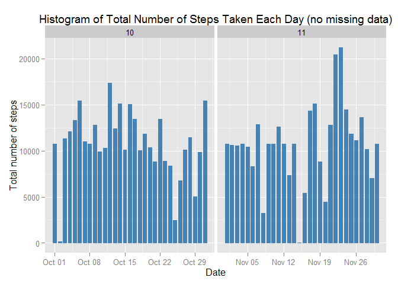

# Reproducible Research: Peer Assessment 1
Geeta Nain  
Tuesday, July 14, 2015  
---
## Loading and preprocessing the data


```r
##unzip dataset
unzip("activity.zip")
##read dataset
activity <- read.csv("activity.csv", colClasses = c("integer", "Date", "factor"))
##adding one more column named month corrosponding to each date
activity$month <- as.numeric(format(activity$date, "%m"))
##3remove na from all data
data <- na.omit(activity)
###setting index for each row
rownames(data) <- 1:nrow(data)
##review changes in data
head(data)
```

```
##   steps       date interval month
## 1     0 2012-10-02        0    10
## 2     0 2012-10-02        5    10
## 3     0 2012-10-02       10    10
## 4     0 2012-10-02       15    10
## 5     0 2012-10-02       20    10
## 6     0 2012-10-02       25    10
```

```r
##see dimesion to confirm if column is added or not
dim(data)
```

```
## [1] 15264     4
```

## What is mean and Median for total number of steps taken per day?

```r
library(ggplot2)
```

```
## Warning: package 'ggplot2' was built under R version 3.1.3
```

```r
##Histogram for total number of steps for each date
ggplot(data, aes(date, steps)) + geom_bar(stat = "identity", colour = "steelblue", fill = "steelblue", width = 0.7) + facet_grid(. ~ month, scales = "free") + labs(title = "Histogram of Total Number of Steps Taken Each Day", x = "Date", y = "Total number of steps")
```

 

```r
###aggregate all data by date to get total steps for each date
totalSteps <- aggregate(data$steps, list(Date = data$date), FUN = "sum")$x
##Finding mean of total steps for whole 2 months
mean(totalSteps)
```

```
## [1] 10766.19
```

```r
#finding median of total steps for whole 2 months
median(totalSteps)
```

```
## [1] 10765
```
## What is the average daily activity pattern?


```r
###aggregate mean of total steps group by interval
avgSteps <- aggregate(data$steps, list(interval = as.numeric(as.character(data$interval))), FUN = "mean")
##naming second column to as it is calculated averaged steps for each interval
names(avgSteps)[2] <- "meanOfSteps"
###plotting time series to see avg steps for all interval
ggplot(avgSteps, aes(interval, meanOfSteps)) + geom_line(color = "steelblue", size = 0.8) + labs(title = "Time Series Plot of the 5-minute Interval", x = "5-minute intervals", y = "Average Number of Steps Taken")
```

 

```r
###checking which interval is having max avg number of steps
avgSteps[avgSteps$meanOfSteps == max(avgSteps$meanOfSteps), ]
```

```
##     interval meanOfSteps
## 104      835    206.1698
```
## Imputing missing values


```r
###checking how many missing values are available in dataset
sum(is.na(activity))
```

```
## [1] 2304
```

```r
##creating new datset for imputing missing value 
newData <- activity
###assigning mean steps of interval to missing value of respective interval
for (i in 1:nrow(newData)) {
if (is.na(newData$steps[i])) {
newData$steps[i] <- avgSteps[which(newData$interval[i] == avgSteps$interval), ]$meanOfSteps
}
}
##checking new data 
head(newData)
```

```
##       steps       date interval month
## 1 1.7169811 2012-10-01        0    10
## 2 0.3396226 2012-10-01        5    10
## 3 0.1320755 2012-10-01       10    10
## 4 0.1509434 2012-10-01       15    10
## 5 0.0754717 2012-10-01       20    10
## 6 2.0943396 2012-10-01       25    10
```

```r
##now againg recheck if there is any mission value, ouput of following should be 0
sum(is.na(newData))
```

```
## [1] 0
```

```r
####againg make histogram from new data, which doesnot have missing value in steps
ggplot(newData, aes(date, steps)) + geom_bar(stat = "identity",colour = "steelblue",fill = "steelblue",width = 0.7) + facet_grid(. ~ month, scales = "free") + labs(title = "Histogram of Total Number of Steps Taken Each Day (no missing data)", x = "Date", y = "Total number of steps")
```

 

```r
####checking if this is different tahn previous one calculated from step 1
newTotalSteps <- aggregate(newData$steps,list(Date = newData$date),FUN = "sum")$x
newMean <- mean(newTotalSteps)
newMean
```

```
## [1] 10766.19
```

```r
newMedian <- median(newTotalSteps)
newMedian
```

```
## [1] 10766.19
```

```r
oldMean <- mean(totalSteps)
oldMedian <- median(totalSteps)
newMean - oldMean
```

```
## [1] 0
```

```r
newMedian - oldMedian
```

```
## [1] 1.188679
```
*Mean is same as calculated from previous dataset, whereas Median is different than previous median. see above value for difference*

## Are there differences in activity patterns between weekdays and weekends?


```r
##Creating two levels as Weekday and weekend in dataset 
head(newData)
```

```
##       steps       date interval month
## 1 1.7169811 2012-10-01        0    10
## 2 0.3396226 2012-10-01        5    10
## 3 0.1320755 2012-10-01       10    10
## 4 0.1509434 2012-10-01       15    10
## 5 0.0754717 2012-10-01       20    10
## 6 2.0943396 2012-10-01       25    10
```

```r
newData$weekdays <- factor(format(newData$date, "%A"))
levels(newData$weekdays)
```

```
## [1] "Friday"    "Monday"    "Saturday"  "Sunday"    "Thursday"  "Tuesday"  
## [7] "Wednesday"
```

```r
levels(newData$weekdays) <- list(weekday = c("Monday", "Tuesday","Wednesday","Thursday", "Friday"),
                                weekend = c("Saturday", "Sunday"))
##checking levels now
levels(newData$weekdays)
```

```
## [1] "weekday" "weekend"
```

```r
###total number of steps for both levels
table(newData$weekdays)
```

```
## 
## weekday weekend 
##   12960    4608
```

```r
###aggregating mean of all steps grouping by inteval and level of weekdays
avgSteps <- aggregate(newData$steps,list(interval = as.numeric(as.character(newData$interval)),
                                         weekdays = newData$weekdays),FUN = "mean")
###naming to avg steps 
names(avgSteps)[3] <- "meanOfSteps"
###
library(lattice)
xyplot(avgSteps$meanOfSteps ~ avgSteps$interval | avgSteps$weekdays,layout = c(1, 2), type = "l",
       xlab = "Interval",ylab= "Number of steps")
```

 
